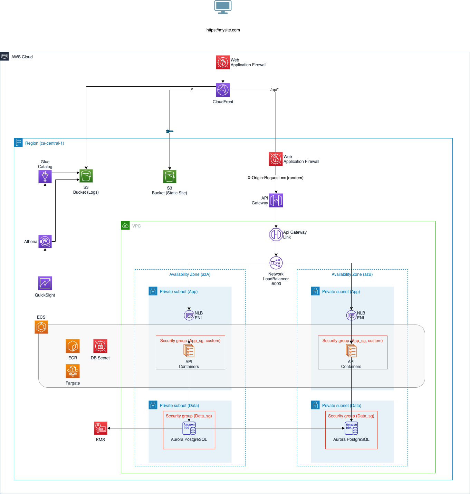

# AWS Secure Environment Accelerator (ASEA) Sample Project

This CDK sample application deploys the following architecture that is compatible with the default configuration of the ASEA.



## Instructions

1. Update the `applicationPrefixName` in .\cdk.json

2. Review the parameters in the bin\aws.ts folder:

```
new SEASampleAppStack(app, `${Prefix}+Stack`, {
  env: {
    account: "", //The AWS Account ID where this stack will be deployed
    region: "ca-central-1", //Primary region
  },
  vpcId: "vpc-", //The VPC ID
  appSubnetIds: ["subnet-", "subnet-"], //App Subnet IDs (default SEA architecture)
  appSecurityGroup: "sg-", //App Security Group ID (default SEA architecture)
  dataSubnetIds: ["subnet-", "subnet-"], //Data Subnet IDs  (default SEA architecture)
  dataSecurityGroup: "sg-",  //Data Security Group ID  (default SEA architecture)
  tags: {
      "Application": "Sample Demo"
  },
  prefix: Prefix,
  dbName: "", //DBName to be used for initial Aurora PostgreSQL database
  staticSiteBuildPath: "", //Path to the /dist folder of a static site
  apiContainerPath: "" //Path to the folder to the containerized API. The dockerfile should exist at this location.
});
```

3. Install project dependencies

This project requires node > 14 and Docker.

```
    npm install
```

4. Build the project

```
    npm run build
```

5. Bootstrap your SEA account

```
    cdk bootstrap --toolkit-stack-name devcdktoolkit
```

6. Deploy the stack

```
    cdk deploy --toolkit-stack-name devcdktoolkit
```

7. CloudFront WAF
The CloudFront WAF is not configured as part of this automation because of SCP restrictions on CloudFormation in us-east-1. The CloudFront WAF must be configured in us-east-1

## Useful commands

- `npm run build` compile typescript to js
- `cdk deploy` deploy this stack to your default AWS account/region
- `cdk diff` compare deployed stack with current state
- `cdk synth` emits the synthesized CloudFormation template

## Accessing the Database

Follow the instructions [here](docs/ConnectingToRDS.md) for one option to securely access the RDS databse.


