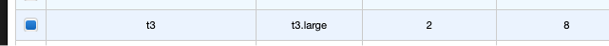
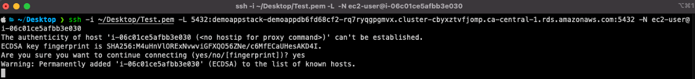
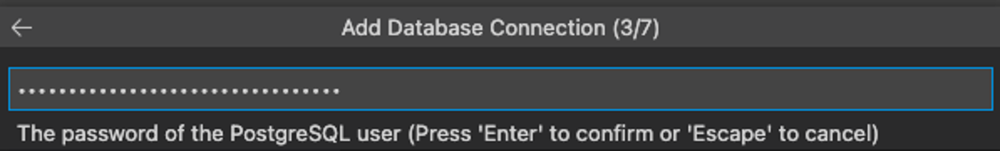
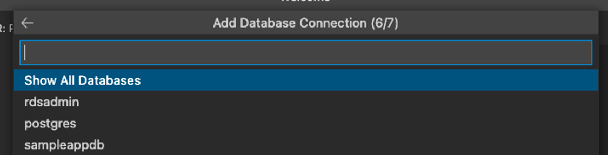

# Connecting To RDS Using Systems Manager Session Manager

## Launch an EC2

1. Launch Amazon Linux 2


1. Pick an EC2 instance size (example: t3.large)


1. Configure necessary settings


1. Accpet default storage settings


1. Give the EC2 a name


1. For Security Group, select the existing **App_sg**


1. Launch the instance AND choose a KeyPair (or create a new one)


1. Document the InstanceId (this will be needed later)


## Configure local SSH config

- Reference: https://docs.aws.amazon.com/systems-manager/latest/userguide/session-manager-getting-started-enable-ssh-connections.html

## MacOS/Linux
On your workstation, add the following to ~/.ssh/config  or if that file doesn’t exist. Create it and paste the following. (This is described in the link above)

```
# SSH over Session Manager
host i-* mi-*
    ProxyCommand sh -c "aws ssm start-session --target %h --document-name AWS-StartSSHSession --parameters 'portNumber=%p'"
```


If you created a new KeyPair for ec2, you need to change its permissions: 
`chmod 400 KeyPair.pem`

## Get Database Connection Details

1. Navigate to Secrets Manager
1. Click on the Database... Entry
1. Click on **Retrieve Secret Value**


## Establish a Secure Tunnel to the Database

```
ssh -i ~/Desktop/Test.pem -L 5432:demoappstack-demoappdb6fd68cf2-rq7ryqgpgmvx.cluster-cbyxztvfjomp.ca-central-1.rds.amazonaws.com:5432 -N ec2-user@i-06c01ce5afbb3e030
```



(There won’t be any further output; the connection is established)

## Connect to the Database

1. Create new DB Connection

1. Specify **localhost** as the database hostname

1. Specify the database username as defined in the Secret

1. Enter the password for the database user as defined in the Secret

1. Enter the database port

1. Choose **Standard Connection**

1. Choose **Show All Databases**

1. Give a name to the database connection string

1. Explore the database
